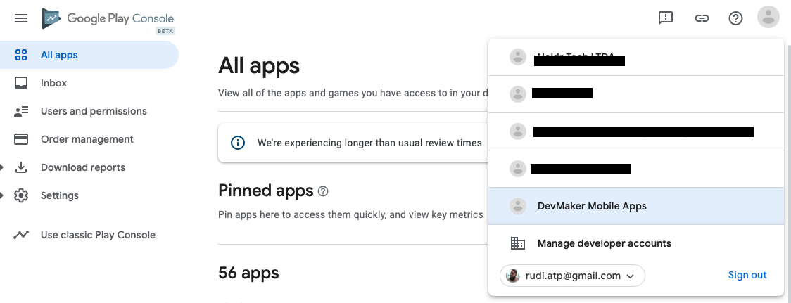
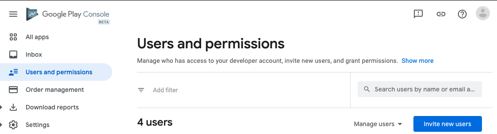
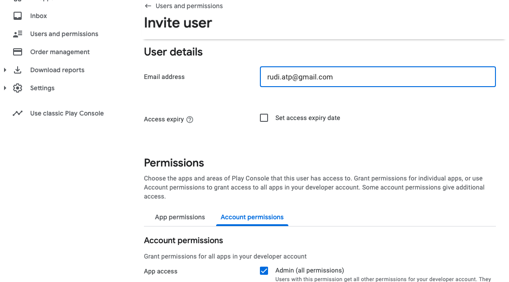
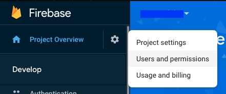
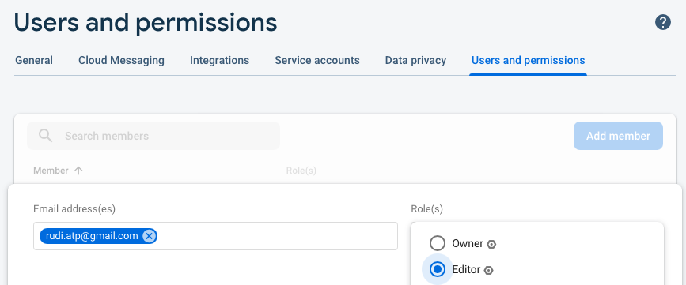
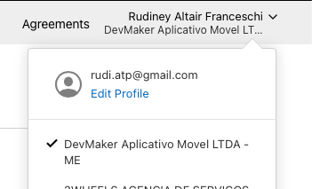
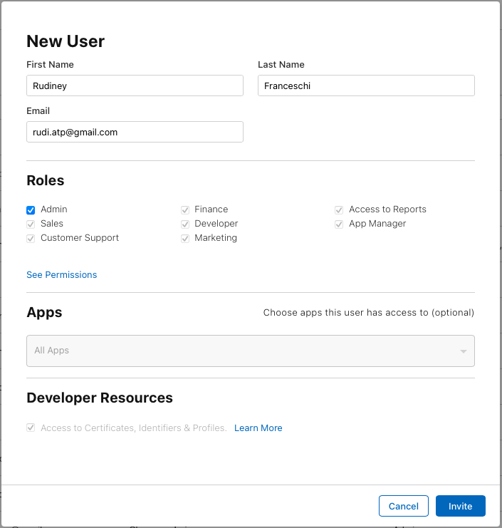

# Adicionar Nossos Acesso na Conta de Publicação

Para publicar um aplicativo nas lojas é necessário que nosso time tenha o devido acesso à conta que será a dona do aplicativo. É importante que uma conta do cliente seja **Owner** da conta e que nossa equipe seja convidada com as devidas permissõe. Dessa forma o cliente é o proprietário da conta e pode tirar nossos acessos quando desejar. Esta forma também evita que seja necessário tranferir a propriedade da conta se o cliente não quiser mais continuar com a DevMaker.

## Acessos do nosso time:

### Google
- Francisco Tavares: `fco.anjos@gmail.com`
- Victor Pereira: `devmaker.victor@gmail.com`
- Rudiney Franceschi: `rudi.atp@gmail.com`
- DevMaker Mobile: `infra@devmaker.com.br`

### Apple:
- Cleverson Luiz: `devmaker.cleversonsouza@gmail.com`
- Rudiney Franceschi: `rudi.atp@gmail.com`
- DevMaker Mobile: `infra@devmaker.com.br`

## Como adicionar:

### Google:
Para o projeto android, precisamos de 2 acessos diferentes: na **Play Console** e no **Firebase**

#### Play Console
1. Acessar: https://play.google.com/console
1. Ter certeza que esta logado na conta certa:
    
1. Em **User and permissions** > **[Invite new users]**
    
1. Nosso time precisa de permissão de Admin para fazer o processo completo de publicação
    

--------------------------------

#### Firebase
1. Acessar: https://console.firebase.google.com
1. Criar um novo projeto
1. Ir em **Users and permissions**
    - 
1. Adicionar o usuário com permissão de **Editor**
    

----------------------------------

### Apple:
1. Acessar: https://appstoreconnect.apple.com/access/users
1. Ter certeza que esta logado na conta certa:
    - 
1. Usar o botão de + pra convidar um novo usuário:
    - O usuário precisa de permissão de **Admin** e **Access to Certificates, Identifiers & Profiles**
    

