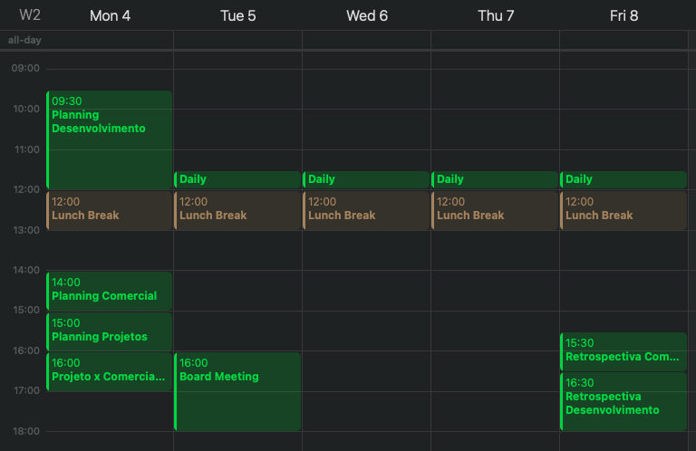

# Agenda

Estas são os horários das [cerimônias](./ceremonies.md) que realizamos toda semana com horário fixo, agendado.

| Dia                | Horário           | Cerimônia                            |
| ------------------ | ----------------- | ------------------------------------ |
| Segunda pela manhã | das 9:30 - 12:00  | Planning de Desenvolvimento          |
| Segunda à tarde    | das 14:00 - 15:00 | Planning comercial                   |
| Segunda à tarde    | das 15:00 - 16:00 | Planning de Projetos                 |
| Segunda à tarde    | das 16:00 - 17:00 | Alinhamento Comercial x Financeiro   |
| Todo dia           | das 11:30 - 12:00 | Daily meeting                        |
| Toda Terça         | das 16:00 - 18:00 | Board Meeting                        |
| Sexta à tarde      | das 15:30 - 16:30 | Retrospectiva Comercial              |
| Sexta à tarde      | das 16:30 - 18:00 | Retrospectiva Desenvolvimento        |

