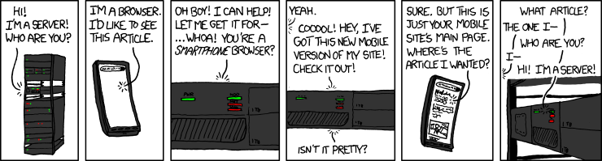

# Devmaker contrata: Desenvolvedor(a) Mobile - React Native

#### O time de desenvolvimento da DevMaker contrata um(a) Programador(a) Mobile para trazer os projetos para a mão dos nossos clientes.

### Sobre a posição:

Como um desenvolvedor Mobile na DevMaker, você será responsável por construir toda a aplicação Mobile, para iOS e Android, de cada projeto
Utilizando React Native, você irá construir toda a estrutura básica do app, as interfaces, padrões
de componentes de UI e navegação entre telas.

Você irá entender em detalhes as funcionalidades do projeto e, junto com o time de back-end entender
a API necessária para mostrar todas as informações necessários no aplicativo e executar todas as
ações esperadas pelo usuário.

Contruímos nossos aplicativos mobile para que toda lógica pesada aconteca no backend.
O aplicativo mobile foca em uma excelênte UI, uma navegação limpa e animações precisas.
Então, você irá ajudar a organizar como seria uma melhor API para construir o que precisa ser feito e será responsável por consumir esta API, montar toda a interface, fluxos de tela e validações que forem necessárias.
Utilizamos Expo, GraphQL com o ApolloClient e Tailwind.
Encontramos nesta stack uma forma incrívelmente fácil construir projetos complexos com pouco esforço.

Você irá somar na atual equipe de desenvolvimento, que é a equipe fundamental para a DevMaker.
É onde cada projeto toma vida!
Seu trabalho reflete diretamente na qualidade do que entregamos aos nossos clientes.
Será sua função construir um aplicativo de qualidade, bem testado, sem bugs e crashes, com uma interface polida e muito agradável.

Temos um time de design que faz a concepção das telas.
Você não vai precisar criar o design das interfaces do zero, você vai receber um design já montado, com esquemas de cores, tamanhos, posições e todo o estilo básico já montado.
Será seu trabalho implementar as telas seguindo este design e que fique bem adaptada para os diversos tamanhos de telas tanto de dispositivos iOS quanto Android.

Você irá trabalhar em equipe, normalmente de 4 a 6 pessoas, com outros desenvolvedores mobile e backend no seu time.
Então é fundamental que saiba se comunicar bem, saiba acompanhar, sincronizar e dividir o trabalho com seus colegas.
É muito importante que consiga demonstrar para a equipe back-end como organizar a API de uma certa maneira facilitaria o trabalho no mobile.

**Esta é uma vaga para Trabalho Remoto.**

A DevMaker possui um contrato de “escritório virtual” na [Regus Business Centre](https://www.regus.com/pt-br/brazil/listings) onde podemos reservar espaços sob-demanda em várias cidades.
Esperamos te receber presencialmente e esporadicamente podemos marcar encontros pessoais mas, assim como muitos negócios nestes últimos anos, estamos trabalhando em HomeOffice.
Mesmo sendo 100% remoto, todo o time DevMaker é muito próximo no dia-a-dia.
Utilizamos o [Discord](https://discord.gg) e com ele conseguimos trabalhar "na mesma sala" mesmo cada um na sua casa 😁

**Aqui são alguns exemplos reais do nosso trabalho que pode te ajudar a entender melhor sobre esta posição:**

- Um novo projeto é iniciado, você e sua equipe recebem uma visão geral sobre o projeto e iniciam um novo projeto em React Native com o Expo;
- Junto com o time, você quebra e detalha melhor a ordem de como será construído;
- Você organiza e padroniza os componentes, aplica o estilo visual necessário e configura o tema básico da aplicação;
- Você codifica as telas, configura a navegação e faz as chamadas de API necessárias;
- Você comunica com o time de QA que determinada funcionalidade está completa e acompanha os testes pra ter certeza que tudo esta 100%;
- Em projetos já construídos, pode ser reportads bugs ou problemas e você precisa investigar a causa e corrigir o problema.

Isso é um pouquinho da nossa organização e nossa experiência, sua experiência e seu conhecimento próprio serão muito bem-vindos para melhorar ainda mais nossos projetos.
Dependendo do seu perfil, oferecemos uma remuneração de R$ 5.000 a R$ 15.000 (+ benefícios) para esta posição.

### Sobre Você:
Procuramos um(a) profissional maduro(a), responsável e com experiência em Desenvolvimento de Software que em pouco tempo possa entender nosso processo, ajudar nos projetos atuais e, iniciar novos projetos.
Você será recebido e treinado pela equipe atual de desenvolvimento e terá contato direto com todas as áreas da DevMaker.

Valorizamos [Gerentes de Si-Mesmo](https://signalvnoise.com/posts/1430-hire-managers-of-one), que seja confiável e tenha a capacidade de organizar não só o seu trabalho mas dos seus colegas.
A estrutura da DevMaker é enxuta, você não terá chefes cobrando em detalhes tudo o que tem feito nem ninguém irá organizar seu dia-a-dia além de você mesmo.

Buscamos quem possua certa experiência com o desenvolmento mobile.
É importante que você entenda, mesmo que por alto, dos desafios de cada plataforma, das diferenças, das exigências e da dificuldade de se ter um aplicativo aprovado na Apple e na Google.

Você não precisa ter uma graduação técnica na área, seu interesse e experiência nesses assuntos terão mais valor do que o diploma de um curso.
Ter uma graduação na área é interessante mas não é um pré-requisito.
Procuramos quem conheça ou deseja aprender ainda mais sobre:

- JavaScript e React Native
- Expo, GraphQL e Apollo
- Testes unitários ou E2E
- Versionamento de códigos com GIT
- Gestão de Requisitos e Metodologias de Desenvolvimento
- Práticas Ágeis (Scrum, Kanban, etc)
- Garantia da Qualidade de Software

### Como Aplicar:

Escreva para o email: [trabalhe@devmaker.com.br](mailto:trabalhe@devmaker.com.br) falando que deseja se candidatar para esta vaga.
Se possível nos diga outras formas de entrar em contato contigo e já nos conte como você se imagina nessa posição e como acredita que pode ajudar no futuro da DevMaker.
Não tem respostas erradas e nem nenhuma pegadinha 😅.
Conte-nos o que te interessa e o que está procurando para sua carreira.
Vamos ler com carinho e você terá nossa total atenção.

Espere uma resposta nossa dentro de duas semanas e, se for seguir para a próxima etapa, marcaremos uma conversa online para nos conhecermos e discutir mas detalhes/dúvidas.
O último passo antes de fecharmos uma proposta será nos conhecermos em pessoa e apresentarmos a todo time que te vai te receber.

Sabemos que mudanças na carreira podem ser uma decisão difícil.
Desde já, queremos agradecer pelo seu tempo e atenção.
Estamos ansiosos para te conhecer melhor e trabalharmos juntos!
