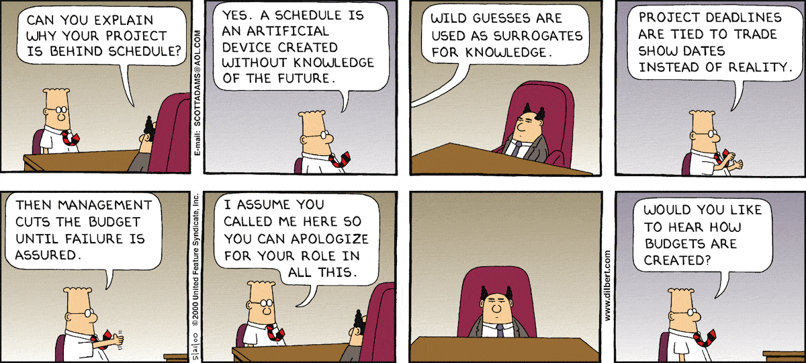

# Devmaker contrata Project Owner

#### O time de Projetos da DevMaker contrata um(a) Project Owner para ajudar a tornar o aplicativo dos sonhos dos nossos clientes em uma realidade.

### Sobre a posição:

Como Project Owner(PO) você será responsável por traduzir a ideia de negócio do cliente em funcionalidades do aplicativo.
Você irá entender a fundo a ideia do cliente, a necessidades e o problema que precisa resolver.
Você terá a equipe técnica, de design e de atendimento a sua disposição para entregar um grande produto para nossos clientes.

Você irá somar na atual equipe de projetos, que é uma equipe fundamental para a DevMaker.
Seu trabalho reflete diretamente na qualidade do produto final entregue ao cliente.
Será sua função manter um contato próximo com o cliente, conduzindo reuniões, esclarecendo dúvidas, negociando detalhes e registrando as decisões.

Você será literalmente o “dono do projeto”, a voz do cliente, dentro da DevMaker.
Você responderá o que o projeto contempla e o que não contempla.
Irá passar o comportamento esperado do aplicativo para o time, vai tirar as dúvidas de requisitos e se certificar que será entregue o que o cliente espera.
Sabemos que é um grande desafio então a posição espera quem saiba se comunicar bem, de forma clara, cordial, direta e amigável.

Além de defender o desejo do cliente no projeto, será sua responsabilidade garantir que as etapas internas do projeto estejam acontecendo dentro do esperado.
Você terá a sua disposição uma série de ferramentas e processos para te ajudar nas estimativas de prazo e no controle de custos.
Você precisará manter as expectativas tanto do cliente quanto do time interno alinhadas com as estimativas.

Esta é uma vaga para Trabalho Remoto.
A DevMaker possui um contrato de “escritório virtual” na [Regus Business Centre](https://www.regus.com/pt-br/brazil/listings) onde podemos reservar espaços sob-demanda em várias cidades.
Esperamos te receber presencialmente e esporadicamente podemos marcar encontros pessoais mas, assim como muitos negócios neste ano, estamos trabalhando em HomeOffice.

**Aqui são alguns exemplos reais do nosso trabalho que pode te ajudar a entender melhor sobre esta posição:**

- Um novo projeto é contratado, você será atribuído como responsável deste projeto e irá escutar diretamente do cliente o que ele deseja;
- Você precisará guiar a equipe de design e desenvolvimento para seguir comportamento esperado das funcionalidades do projeto;
- Uma vez tendo entendida a dimensão do projeto, você organizará a agenda de entregas e a estimativa de esforço;
- Você manterá o cliente informado do progresso do projeto e, ao final do desenvolvimento, irá apresentar e homologar o aplicativo final com o cliente;
- Em projetos já publicados nas lojas, os clientes podem reportar problemas e você, com a equipe de projetos, investiga, reproduz e coordena as correço.

Isso é um pouquinho da nossa organização e nossa experiência, sua experiência e seu conhecimento próprio serão muito bem-vindos para melhorar ainda mais nosso processo.
Dependendo do seu perfil, oferecemos uma remuneração de R$ 5.000 a R$ 10.000 (+ benefícios) para esta posição.

### Sobre Você:
Procuramos um(a) profissional maduro(a), responsável e com experiência na área de Gestão de Projetos e Desenvolvimento de Software que em pouco tempo possa entender nosso processo, ajudar nos projetos atuais e, em breve, conduzir completamente um projeto.
Você será recebido e treinado pela equipe atual de projetos e terá contato direto com todas as áreas da DevMaker.

Valorizamos [Gerentes de Si-Mesmo](https://signalvnoise.com/posts/1430-hire-managers-of-one), que seja confiável e tenha a capacidade de organizar não só o seu trabalho mas dos seus colegas.
A estrutura da DevMaker é enxuta, você não terá chefes cobrando em detalhes tudo o que tem feito nem ninguém irá organizar seu dia-a-dia além de você mesmo.

Buscamos quem possua certa experiência técnica.
É importante que você entenda, mesmo que por alto, das soluções técnicas e consiga ligar isso ao produto final esperado.
Também é interessante que tenha experiência prática com gestão de projetos, que possua boas habilidades inter-pessoais pois você irá se relacionar com clientes de diferentes perfis.

Você não precisa ter uma graduação técnica na área, seu interesse e experiência nesses assuntos terão mais valor do que o diploma de um curso.
Ter uma graduação na área é interessante mas não é um pré-requisito.
Procuramos quem conheça ou deseja aprender ainda mais sobre:

- Processos de Desenvolvimento de Software
- Gestão de Requisitos e Metodologias de Desenvolvimento
- Práticas Ágeis (Scrum, Kanban, etc)
- Garantia da Qualidade de Software

### Como Aplicar:

Até dia 07/11/2020 nos escreva para o email: [trabalhe@devmaker.com.br](mailto:trabalhe@devamker.com.br) falando que deseja se candidatar para esta vaga.
Se possível nos diga outras formas de entrar em contato contigo e já nos conte como você se imagina nessa posição e como acredita que pode ajudar no futuro da DevMaker.
Não tem respostas erradas e nem nenhuma pegadinha 😅.
Conte-nos o que te interessa e o que está procurando para sua carreira.
Leremos com carinho e você terá nossa total atenção.

Espere uma resposta nossa dentro de uma semana e, se for seguir para a próxima etapa, marcaremos uma conversa online para nos conhecermos e discutir mas detalhes/dúvidas.
O último passo antes de fecharmos uma proposta será nos conhecermos em pessoa e te apresentar o restante do time que te receberá.

Sabemos que mudanças na carreira pode ser uma decisão difícil.
Queremos já agradecer seu tempo e dedicação.
Estamos ansiosos para te conhecer melhor e possivelmente trabalharmos juntos!
