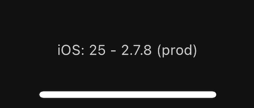
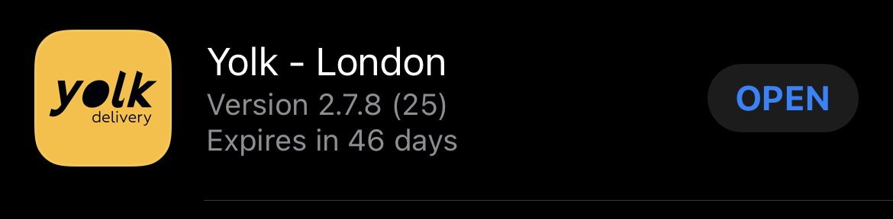

# Tudo sobre Builds/Versões/Servidores/Releases/etc

Esta descrito aqui a forma que nós da DevMaker organizamos os diferentes aspectos de fazer uma build
de um app mobile, gerenciar versões das apps, as faixas de teste Google e Apple, os servidores no
Heroku e tudo envolvido nesse processo.

Por mais que existam diferentes formas e outros recursos para estes procedimentos, essa é a maneira que nós
escolhemos para nomear cada termo e organizar cada procedimento para facilitar nossa vida.

# Conceitos:

## Servidor no Backend - Staging e Production
O time de backend da DevMaker constrói uma única aplicação Rails que contempla tanto o painel web, o site (se existir), e também a API utilizada pelos apps mobile.
Criamos 2 servidores completamente isolados no Heroku (2 apps, 2 bancos de dados, 2 tudo)

**O servidor de Staging:** é criado já no inicio do desenvolvimento do projeto e é atualizado assim que uma tarefa no back é completada.
Mesmo antes da Story ir para ToTest o back atualiza o servidor de staging com o que muda na API para o mobile construir o que precisar.

Assim, em staging só existem dados fictícios, de teste que utilizamos durante a construção do projeto.
**O cliente final não deve acessar este servidor**.

**O Servidor de Production:** é criado na entrega do projeto, para o cliente e os usuários finais utilizarem.
Ele já é o ambiente final onde tem os dados reais dos usuários do APP. O servidor de production é atualizado poucas vezes.
Por ex: só depois que todos os ajustes da garantia ou quando todos as Stories do mês da manutenção foram aprovados pelo QA

👉  Cada ambiente só roda uma única versão backend. Não existe um ambiente de Staging rodando em paralelo a versão A e B por exemplo.

## API no Mobile
Cada versão do app mobile esta utilizando a API de **somente um** dos servidores do backend.

👉  Não se pode ter a versão X do aplicativo usando tanto Staging quando Production.

Então a versão "8" do app pode estar apontando para o servidor de **Staging** e, para passar a usar o servidor de **Production**, deve ser criada uma build com uma nova versão.

## O que é uma build no mobile?

No mobile, "Gerar uma build" é o processo de empacotar o aplicativo no formato que cada loja deseja

- **Google:** `.aab` (AppBundle)
- **Apple:** `.ipa`

Com isso é gerado um arquivo com o aplicativo que pode ser instalado pelos usuários.
Sempre que enviamos para aprovação das lojas, é enviado uma build.
O processo de se gerar uma build pode **demorar horas** e existe um trabalho manual de fazer o upload da build para as lojas.

👉  Cada build tem um número único exigido pelas lojas. Não é possível enviar para as lojas 2 builds com o mesmo número.

Normalmente é necessário gerar uma build nova para cada nova versão do app porém, a Expo tem um recurso para liberar-mos uma versão sem novas builds.

### Desenvolvimento do APP sem Builds

O Expo nos permite desenvolver todo um aplicativo sem precisar fazer uma nova build a cada nova versão!
Isso nos economiza MUITO tempo (nosso time faz certa de 10 versões novas por dia) mas tem alguns detalhes que precisamos cuidar.

Quando uma build do app é gerada, é gerada usando um `release-channel`.
Usamos este `release-channel` pra atualizar a versão do app presente nesta build.

Para desenvolvimento e testes, usamos o ExpoGo e ele utiliza o `release-channel=default` (que é o padrão)

## Versão do APP

Como podemos ter versões novas do app sem fazer builds novas, existe um número diferente que representa a versão do app em sí (e não da build).
Este número, seguindo o padrão [SemVer](https://semver.org), tem o formato: `X.Y.Z`

Este número muda a cada detalhe feito no app mobile, por menor que seja.
Sempre que enviamos uma versão para o QA testar, é alterado este número e feito um **publish num
release-channel**

Com isso, é possível ter a Build 1, que primeiro utiliza a versão 1.0, mas depois de um publish ela
pode passar a usar a versão 1.1

### Um Publish?

Publish é o nome do processo de lançar uma atualização de um aplicativo **sem precisar gerar uma nova build!**

Quando o time faz um *publish*, uma nova versão é liberada para o `release-channel` informado (o channel `default` é adotado por padrão).

o ExpoGo, usado pelo time de QA para testes, esta usando o `release-channel=default` por padrão.
Assim, quando o time mobile faz um *publish* o ExpoGo recebe esta atualização.

Além do ExpoGo, toda build gerada usando o `release-channel=default` **também é atualizada!**

Esta atualização é aplicada automaticamente a próxima vez que o aplicativo é aberto.
Por isso é necessário encerrar o app e abrir novamente.

Então, quando geramos uma build que vai ser liberada para o público em geral, **ela deve usar o
`release-channel=production`** ⚠️

## Conferindo a versão instalada

Para nos facilitar saber qual versão exata da build e do app esta sendo executada é apresentado esse
números em diferentes lugares nos apps. Por exemplo:

| Tela de perfil no CEPETI | Menu lateral no Yolk |
|--------------------------|----------------------|
|  |  |

Seguindo esta entrutura:

- `[Plataforma]: [Número da Build] - [Versão do app] ([Servidor de API utilizado])`
- Então: `iOS: 25 - 2.7.8 (prod)` significa que é a versão pro `iOS`, build número `25`, versão do app `2.7.8` usando o servidor de `prod` do backend
- **Repare** que, no exemplo do CEPETI acima, quando abrimos o APP pelo ExpoGo, ele **não possuí um número de build**

Alguns destes mesmos números são mostrados nas lojas:

| No TestFligt |
|--------------------------|
|  |

# Liberação do aplicativo nas lojas

Para o cliente e seus usuários instalarem o aplicativo, é preciso enviar uma versão do APP para as
lojas. **O cliente nunca utiliza o ExpoGo**.

Para cada nova liberação na loja seguimos o seguite processo:
1. Gerar uma nova build. Fechando a versão do app que vai ser liberada;
1. Upload da build pra loja;
1. Esta build passa por uma rápida revisão antes de estar liberada de **forma privada**;
1. Somente usuários convidados (testadores) podem baixar esta build e testar;
1. Estando tudo certo com esta build, solicitamos a aprovação das lojas para **liberacão ao público** em geral

Então

1. Liberar apenas para usuários convidados, (por ex: o cliente e quem for testar do lado dele) é a **Liberação Privada**
    - Na Apple é feita usando o **TestFlight**
    - Na Google é feita usando a **Faixa de Testes Interno**
1. A liberação para o público final, para qualquer pessoa buscar e encontrar o aplicativo na loja é chamada de **Liberação Pública**.

Só depois que a loja revisar e aprovar o aplicativo é que ele pode ser instalado por qualquer pessoa.
O tempo de revisão de cada aplicativo varia muito. Pode variar de algumas horas para algumas semanas!

Se o aplicativo for reprovado e necessitar alguma alteração, todo o processo é re-iniciado: Nova
build -> upload pra loja -> revisão rápida -> liberação privada -> solicita aprovação novamente

👉  Em cada ambiente **Público** ou **Privado** só pode existir uma build.
Se a build A está liberada ao público, a build B pode estar em privada mas, vai substituir a versão A quando for liberada ao público

## Liberação Manual ("enter pro pai")

Existe a opção de solicitar a aprovação da build mas não liberar ela ao público imediatamente.
Então a build pode ficar um tempo já aprovada na loja e só aguardar o apertar de um botão para ser realmente liberada.
