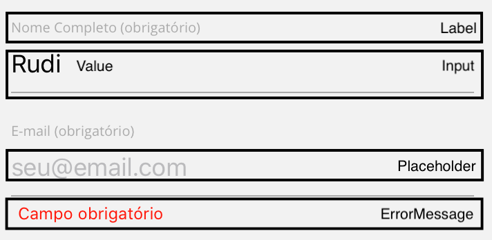

# Conceito

## Field

É o compononte individual de cada input de dados da tela. 
Existem dezenas de tipos de fields diferentes, dos mais simples como `text` ou `select` até complexos como `avatar`, `attachments` ou `address`.

Usamos uma estrutura comum dentre todos os fields (seguida pelo component [Input](https://react-native-elements.github.io/react-native-elements/docs/input.html) do react-native-elements) onde todo field tem:

- `label`
- `value`
- `onChange(newValue)`
- `placeholder`
- `errorMessage`

### Anatomia Básica:

## Form

É um componente "virtual", ele em sí não tem aparência nenhuma, a função dele é:
1. Agrupar todos os fields;
1. Iniciar todos os fields com valores;
1. Guardar o valor atual de cada field;
1. Validar se todos os fields estão válidos (e não submeter se tiver erro);
1. Mostrar a mensagem correta de erro em cada field;
1. Ter o botão de submit, enviar todos os field values no submit e e deixar o botão loading enquanto o submit ocorre;